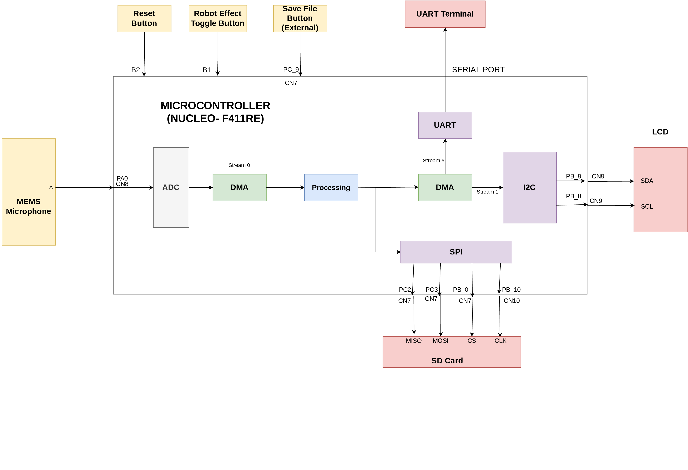
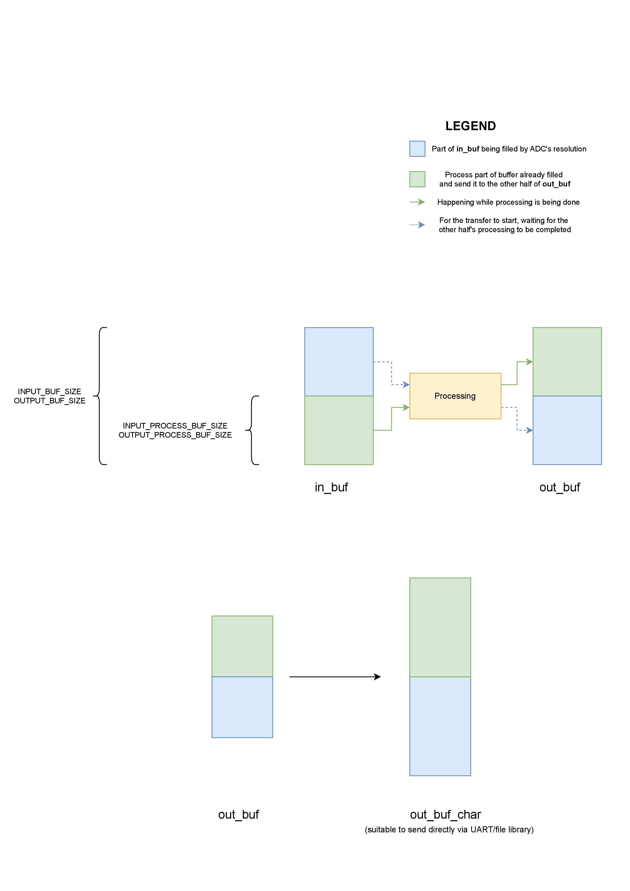
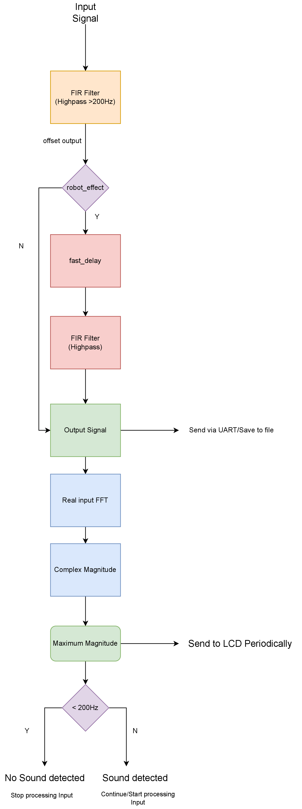
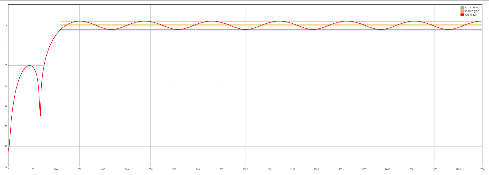
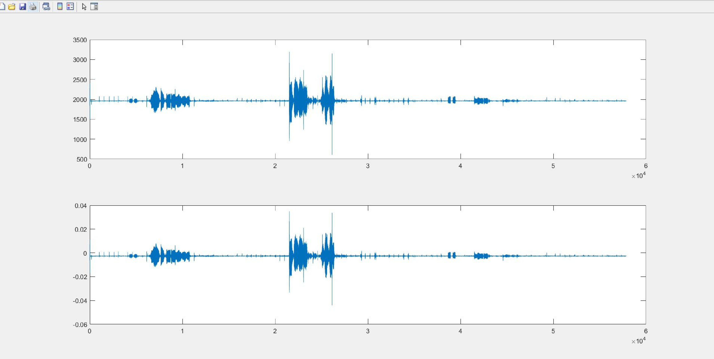

# Real time DSP for MEMS Microphone

## Features
- Reads input data via MEMS microphone module (`SEN0487`), and transfers it to memory (through `DMA`)
- Displays the dominant frequency in 16x2 LCD display (through `I2C`)
- A button for simulating robot effect in input (via fast delay)
- Saves the processed input to SD card (through `SPI`)
- During debugging, live data can be read (via `UART`). Only display / save output if there is sound activity detected.

Supported in STM32F411RE

# Hardware Connections



The hardware and the relevant protocols are as follows:

## Microphone

-   Protocols used => **ADC + DMA**

We use a Female MEMS microphone module `SEN0487 - Manufacturer DFROBOT [MIC Module (V1.0) [21BLg] 65Z5]` which has a gain of 66. This module can be used at both 3.3V/5V (downscaling of 5V -> 3.3V is present in the module itself). For the purposes of long time safety, we use the 3.3V version. We can get an acoustic waveform by ADC sampling from the initial analog input audio signal from the microphone. When there is no input signal then its output voltage is around 0.66\*VCC.   

Here microphone is used as an input device for the project which gives acoustic waves signals to ADC for further process of the project. The microphone’s `A` pin is connected to the IN0 function of the ADC peripheral which is the `A0/PA0` (since our initial input is analog so we need to have an ADC converter - given through this port).   

To save unneccessary clock cycles to save it to contiguous memory locations in the buffer and doing the fixed process of resolution again, this process is taken care of by the DMA. We use a circular buffer of a fixed size and the input is taken as half words (since we are using 12 bits for resolution - the maximum available in this module for maximal precision).


## SD Card

-   Communication Protocol => **SPI**

SPI communication protocol supports full-duplex communication, which means data can be transmitted and received at the same time. It has good signal integrity, supports high-speed (near about 60M bits/sec) applications and its hardware connection is simple, and only four signal lines are needed. Along with that, the slave device does not need to be addressed. In this project we need to save a large amount of data at a high speed hence we used the SPI communication protocol (it is faster than UART and I2C communication protocol) for saving data on the SD card.   

The output data of the project is saved on an SD card. For connecting SD card with a microcontroller SD card adapter `Makerverse MicroSD Card Adapter (3.3 and 5V compatible - SKU: CE07926)` is used, which is connected to the SPI serial communication peripheral of the microcontroller. The used voltage is 5V for efficient usage of SD Card. We also send the data at 20 MB/s, which seems to be compatible with the SD Card that we use (supported upto 75MB/second).


## LCD

-   Communication Protocol => **I2C**

I2C interface communication protocol has a low pin/signal count even with numerous devices on the bus which is a half-duplex protocol. That means data can transfer in a single or one direction. It is a medium speed of 10K – 3.4M bits per sec. Due to the high speed and the need to send the data to one direction (i.e. LCD), we have used the I2C interface communication protocol. The LCD is used to display the maximum frequency of the processed data and whether the robot effect is on or off.   

We use a `lcd-1602a-qapass` LCD module with soldered pins and inbuilt I2C module for communication. It is connected to the I2C serial communication peripheral for showing a dominant frequency of the audio signal and the status of the robot effect.


## Push button

-   Communication Protocol => **GPIO**

There are two push buttons (black and blue colored) available on the Nucleo F411re microcontroller board (`B1` and `B2` respectively). B2 has been allocated to it&rsquo;s default functioning (resetting the system). Since we couldn’t use the **RESET** button for interrupting any task or event in the project, we added an **third external push button** which is used for closing a current file on SD card and opening a new file for saving data (and connected to `PC_9`).   

The user-defined blue push button (`B1`) is used as an interrupt for toggling the robot effect (using the high privacy mode/not).


## USB Peripheral display output

-   Communication Protocol => **UART**
    
    UART interface communication protocol can be used without having a common clock signal. Even though the speed of UART is low (Around 200KB / sec), it&rsquo;s overhead is very low. For this, we have used the UART communication protocol for showing a large amount of the processed output data independent of the clock signal on the computer. Although, because of limitation on speed, we kept the sampling frequency at 4KHz for the implemention to show the correct results.


# Implementation


## Design Flow

1.  Microphone sends data to Microcontroller at 4000Hz
2.  Through ADC and DMA, store the data in input buffer
3.  Pass input data to a high pass filter to remove signals which have a frequency below 200 Hz.
4.  If robot effect is on, then enable privacy mode. Processing of privacy mode is done by the robot effect (implemented by fast delay) and then a different high pass filter is used (according to the person&rsquo;s voice) to remove low-frequency signals.
5.  The output data is shown on UART.
6.  The output data will pass to FFT and then the maximum dominant frequency will display on LCD.
7.  All processed data will save on the SD card.
8.  By using audio signal processing libraries on the PC (file provided in MATLAB), we can hear our desired output audio.


## Data Flow in Buffers

Since we are working on a large amount of continuous analog input data, where real-time processing needs to be implemented with constraints on the size of the buffer possible. Hence the frame based processing (block) is used to process the data. A 4 buffer ping-pong is used to processing a complete block of the sample, while the other half is being inputted.


### Pong Buffers used in the project:

-   `q15_t in_buf [INPUT_BUF_SIZE]` = Used to store data or samples that are captured from a microphone
-   `q15_t out_buf [OUTPUT_BUF_SIZE]` = Used to store data or samples after processing
-   `char out_buf_char [OUTPUT_BUF_CHAR_SIZE]` = Used for sending data in a string via UART and saving file I/O


### Pointers to buffer&rsquo;s are used to fill currently data in buffer at exact address:

-   `q15_t* in_buf_ptr` = Input buffer pointer
-   `q15_t* out_buf_ptr` = Output buffer pointer
-   `char* out_buf_char_ptr` = Output character buffer pointer


### Size of buffers used in the project:

-   `FILTER_TAP_NUM 30` -> for implementing a high pass filter (originally, there were 29 tap values) are used that is filter coefficient values as per designed filter values. Since the number of taps needs to be even, I made the last tap have the value as 0
-   `INPUT_PROCESS_BUF_SIZE 512` –> 512 samples will be processed in a single block. This was deemed optimal for maximal processing while signalling to display to UART and writing to a file
-   `INPUT_BUF_SIZE (INPUT_PROCESS_BUF_SIZE * 2)` -> input buffer size has double the size of the input process buffer size (ping and pong of the buffer).
-   `OUTPUT_PROCESS_BUF_SIZE = INPUT_PROCESS_BUF_SIZE`
-   `OUTPUT_BUF_SIZE = INPUT_BUF_SIZE`
-   `OUTPUT_PROCESS_CHAR_BUF_SIZE (INPUT_PROCESS_BUF_SIZE * 5)` -> This Output process character buffer has 5 times the size of the input process buffer size to use the processed data in a character form for (a) displaying in UART (consisting of 4 characters separated by `\n` at a time) and (b) to save file SD card.
-   `OUTPUT_BUF_CHAR_SIZE (OUTPUT_PROCESS_CHAR_BUF_SIZE * 2)` -> Maps to other part


## Reason to choose q15<sub>t</sub> for processing

The Q15 number has a integral range between `(-2^16)` and `(2^16 - 1)`, scaled up from (-1.0, 1.0) w.r.t. floating point numbers. Since the operations in this type are done between integral types which are much faster than their counterparts (floating point types), it makes it very convenient in DSP where real time processing has to be completed.


## Flow of data in buffers

-   The input buffer size has a double size of the input process buffer size. The input data from ADC will store in the input buffer. When half input buffer will be full (we can call it a single block) then the interrupt for the DMA will update the pointers to the input and output buffers and update the the flag `write_file_chunk_flag`. This will further trigger the `process_data` function/event for that block. After processing is completed, that processed data will store in half of the output buffer.
-   Also, the data which is currently in the form of integers will be stored in the output character buffer in the form of a string that will be shown on the UART terminal.
-   Simultaneously, while processing the first block or half input buffer, the remaining half input buffer will store data via DMA, after completely full the input buffer and the ping buffer previously will become the pong buffer and the the two buffers will now play the opposite roles.
-   This process is continued in a circular manner.
-   In this project we are working with a large amount of data hence DMA is working as the pipeline for storing data in buffers and also sending data to UART.



## Interrupts


### Half buffer Interrupt ADC

Used to indicate first half input buffer is full and to trigger the processing activity. If 512 samples will be filled in the input buffer then this half buffer interrupt will generate and will trigger processing activity for that stored data.


### Full buffer Interrupt ADC

Used to indicate the input buffer is full and to trigger processing activity for that stored data. When the second half input buffer will full then the second interrupt will interrupt the input process and will indicate the input buffer is full and will trigger the processing activity for the remaining input data.  After triggering the processing activity again input will start to store input buffer in the first half input buffer.


### Robot effect Interrupt

Used to toggle the robot effect flag. If there is no privacy mode then high pass filtered data will directly show on UART and will pass to FFT. When pressing the robot effect button then it will interrupt the process of sending data to the UART directly from the high pass filter. That interrupt will send high pass filtered output data into robot effect processing activity and then the output data will show on UART.


### Save file Interrupt

The interrupt is not handled as a EXT GPIO interrupt. Instead, the value is read at an appropriate time (so as to avoid race conditions), which debounce functionality. If the read value is 1 (then an indication is sent to save the file).


## Timers

-   `TIM2` for the ADC&rsquo;s DMA to synchronize to input values and store them into the input buffer. It was chosen since the timer needed to be somewhat advanced with supported DMA and interrupts. We set it&rsquo;s Prescaler as `10-1`, and the counter to `2500-1` to get desired input samples in real-time at the desired frequency. By this setting, we will get around 4000 samples in 1 sec. As `TIM2` starts ADC will start taking input values and will store output values in the input buffer via DMA synchronized with `TIM2`.
-   `TIM9` as the timebase source for FreeRTOS. It was chosen because the timebase source needed to be simple enough for count reference.


## Input data / ADC

-   The microphone is connected to ADC peripheral to convert analog signals to digital signals. The microphone will send acoustic waveforms of input audio to ADC peripheral. ADC peripheral will convert that analog signal into digital data that digital data ADC stores input data in the input buffer via DMA peripheral.
-   For taking real-time input, the CPU clock is set to 100MHz, and to take ADC samples for the desired frequency ADC clock Prescaler is set to `10-1` i.e., PCLK divided 10 and resolutions to 12 bits (15 ADC clock cycles) which means will take values between 0 to 2<sup>12</sup> bits.
-   Hence ADC samples can be taken independently from the CPU clock. The **sampling frequency** is calculated by the formula
    
        Sampling rate = (f_PCLK2 / prescaler) / (N_s + N_c)
        
        where
        
        f_PCLK2 = 100MHz
        prescaler = 10 - 1
        N_s = 2500 - 1
        N_c = 15

Hence, the sampling rate is around 4000Hz

    Sampling rate = (100 Mhz / 4) / (2500 + 15) = 4000 Hz

-   Also, we connect DMA peripheral to the ADC1 peripheral to send a large amount of data from the peripheral to memory without disturbing the clock cycles once the DMA pipelines have been set.
-   The microphone will send acoustic waveforms to ADC and will convert that analog signal into digital signals. That digital signals or sampling data will be stored in the input buffer for processing.


## FreeRTOS

FreeRTOS provides the core real-time scheduling functionality, inter-task communication, timing, and synchronization primitives, described as a real-time executive. Here in this project since we have concurrency and we need to keep the CPU busy waiting time as minimal as possible (considering that we are processing data, saving files on an SD card, and sending output data on LCD as loosely coupled entities). Hence FREERTOS is being used in the project. There are 3 tasks created for (a) processing data, (b) saving files on SD card, and (c) sending output data on LCD. As of now, all the priorities are set equal and these three tasks will schedule accordingly.

The causal relations are defined as

-   Only when the buffer has been processed, send it once to UART and writing to the file
-   Only update the lcd values after each second


# Data processing



To process the data in the MCU, the CMSIS DSP software library is used (v4.35) [2]. In particular `arm_math.h` library and lib file are imported into the project which has functions on FIR filtering, FFT transforms, maximal amplitudes, etc.


## High pass filter



-   A high pass filter is a filter that passes high-frequency signals and blocks, or impedes, low-frequency signals. For this step, we use a custom FIR filter which is used to remove frequencies below 200Hz.
-   The corresponding FIR filter is designed by using T-Filter [1]. Using this software, we got the desired tap values that is filter coefficient values for implementing the high pass filter in the project. For designing set values according to project task requirements which are as follows:

<table border="2" cellspacing="0" cellpadding="6" rules="groups" frame="hsides">
<caption class="t-above"><span class="table-number">Table 1:</span> High Pass Filter Logic</caption>

<colgroup>
<col  class="org-left" />

<col  class="org-left" />

<col  class="org-right" />

<col  class="org-left" />

<col  class="org-left" />
</colgroup>
<thead>
<tr>
<th scope="col" class="org-left">from</th>
<th scope="col" class="org-left">to</th>
<th scope="col" class="org-right">gain</th>
<th scope="col" class="org-left">Ripple/Attenuation</th>
<th scope="col" class="org-left">Actual Ripple</th>
</tr>
</thead>

<tbody>
<tr>
<td class="org-left">0 Hz</td>
<td class="org-left">150 Hz</td>
<td class="org-right">0</td>
<td class="org-left">-20 dB</td>
<td class="org-left">-20.08 dB</td>
</tr>


<tr>
<td class="org-left">220 Hz</td>
<td class="org-left">2000 Hz</td>
<td class="org-right">1</td>
<td class="org-left">5 dB</td>
<td class="org-left">4.14 dB</td>
</tr>
</tbody>
</table>

-   We require 29 tap values (filter coefficients) to design the high pass filter.
-   When a part of the input is ready to be processed, we call the `process_data()` function, where blocks of 512 samples are stored in the input process buffer.
-   For implementing a high-pass filter the DSP library needs to instantiate the required FIR settings. Hence, we declare an FIR instance `arm_fir_instance_q15 fir_settings` and also needs internal FIR states which have a size always equal to `INPUT_PROCESS_BUF_SIZE + FILTER_TAP_NUM - 1`.
-   Finally, for applying the FIR DSP library has the corresponding function as:
    ```c
    arm_fir_q15(&fir_settings, in_buf_ptr, out_buf_ptr, INPUT_PROCESS_BUF_SIZE);
    ```
-   Here, we passed the address for FIR instance setting, input buffer pointer for processing input data, and output buffer pointer to store processed output data in the output buffer. Output data will store in the output buffer for further process and data to display on UART.
-   In the process, frequency below 200Hz will be filtered out and amplitude will be normalized.
-   After using a high pass filter, we give an offset of 2000 to keep the amplitude in suitable form for further processing / displaying on UART / saving to file. (since further calculation of negative values is difficult to do and is less feasible).


## Robot effect

For robot effect here fast delay implemented


### Fast delay

-   Here, we have implemented fast delay. We took the summation of 5 samples with the following formula w.r.t. real time signal:
    ```
    a[n] = ATT_FACTOR * (a[n] + a[n - 1] + a[n - 2] + a[n - 3] + a[n - 4])
    ```
-   Here, `ATT_FACTOR` is used to keep the echo more realistic in nature. It could be set between 0 and 1. In this case, I have set it to 1.
-   Note that since the robot is taken w.r.t. buffers, it supports wrap-around logic; i.e. a[0] would consist of the sum of `a[508 - 511]` and itself.
-   In short, we divided samples into chunks and take the summation of the previous four samples and one current sample.
-   In addition to summing, we reduce the offset of the signal by `7000` to normalize the signal again, so that it doesn&rsquo;t overflow while we do the FIR filtering.


### High pass filter

That data again passed to a high pass filter to remove low-frequency data created by the robot filter itself (depending on the user the cutoff frequency could be different, we assumed that it was the same as before so we kept the same taps for this time too). After passing the signal through a FIR filter again, we provided an offset of 2000 to keep the amplitude of processed data in acceptable ranges before for sending it to UART / saving it.


### Output


-   The same speech &ldquo;Hello testing UART&rdquo; gives two different types of outputs on the basis of whether the robot effect is on or not. As shown in figure 5, the first disturbance is without the robot effect and the second disturbance is with the robot effect (spaced out amplitudes but having higher overall frequency due to meshing of sound), we can see the transformation in the signals before and after processing.
-   In the first disturbance, only low-frequency signals are filtered out where the amplitude of the signals is less and no delay in the signals.
-   But in the second disturbance where the robot effect is applied the amplitude of the signals is increased and normalized around 2000 and also has a delay in the signals.
-   We can also see the filtering of low signal output having low ripple and attenuation (almost ignored in the final generated sound file)


## FFT

For implementing FFT, since we are taking it for a buffer in the real domain, we use the inbuilt function `arm_rfft_q15` with the appropriate settings. The output buffer will be twice the size of the input buffer (since it contains both real and complex amplitudes), and the input buffer will be modified. Hence

-   `fft_output` = `2 * fft_input` w.r.t. size
-   We need to make `fft_input` as a separate buffer and cannot directly use `out_buf` since the input buffer is modified according to the documentation.

-   Hence, we use the following function with the parameters
    ```c
    arm_rfft_q15(&fft_settings, (q15_t* ) fft_input, fft_output);
    ```

-   Now, since we have the output in the complex range, we need to calculate the magnitude first. We can do that by using the function `arm_cmplx_mag_q15`. Before doing that, we also need to upscale the output by 256 times to prevent underflow errors
    ```
    for (int i = 0; i < OUTPUT_PROCESS_BUF_SIZE * 2; i++) {
    	fft_output[i] <<= 8;
    }
    arm_cmplx_mag_q15(fft_output, fft_output, OUTPUT_PROCESS_BUF_SIZE);
    ```

-   We store the list of magnitudes in the first half of `fft_output` itself (to save buffer space)

-   Finally, the maximum value of the calculated magnitudes in a frame is taken and the amplitude and frequency are stored in `max_ampl` and `max_fft_freq` respectively
    ```
    arm_max_q15(&fft_output[1], OUTPUT_PROCESS_BUF_SIZE - 1, &max_ampl, &max_fft_freq);
    ```

-   From here, `max_fft_freq` is checked for the appropriate values to check for sound activities. The value is polled at every second at the LCD where the output is shown. But the value is calculated everytime to detect sound activity.


## Sound activity

If `max_fft_freq` < 200Hz then no sound is detected else sound is detected. A mini timer through `fft_counter` is implemented to debounce any mistakes in no sound being detected (5 seconds for no sound pop up to come up, and 1 second of contiguous voice to start the process again)


## Conversion to out<sub>char</sub><sub>buf</sub>

The following statement is used:

    sprintf (sample_out_msg, "%4.4hd\n", out_buf_ptr[i]);

for each value in output buffer which is ready to convert it in `sample_out_msg` (then used in `out_buf_char_ptr`). `sprintf` takes care of padding with 0&rsquo;s (if there are less than 4 digits), trimming (if there are more than 4 digits), and separating each input by `\n`


# Output data


## UART

As soon as one block of the data is processed, it&rsquo;s character representation is stored in the output buffer `out_char_buf`. To display processed data via serial communication on PC that stored data will be sent to UART. A UART Terminal Client is used to display data on pc via serial communication (For example Hercules / CoolTerm). For the project, we have set the baud rate at the maximal possible speed (230400 baud).


### Live Graph

See code on appendix A (shown during demonstration)


## SD Card


### Mount

Initially, the file system of the SD card is mounted into memory and checked for success/failure. If there is an error with the file system / other problems in mounting then the appropriate error message will be shown. For debugging purposes, we also check for the free space and calculate the total size of the SD card using the pointer and the size and free space of the SD. These results are also displayed in UART, and after the initialization time, data is started to be written into the buffer.


### Write

-   After processing a block of sample data in ping, the processed data will be stored in the output buffer (`output_char_buf`) and the necessary flag will be generated to (a) enable the SD card saving function (b) Enable DMA to send the processed data to UART. Contiguous writing of the appropriate block of `output_char_buf` (first/second) will be send on the basis of which block is ready as of now.

-   The file is only closed when the user presses the external button for saving the file. The process of opening and closing the file is not done again and again since then we would need to use `seek` in it again and again, making the total time `O(n^2)` for saving a block of size n. Only writing and closing the file once and making up a new file with the button would taken `O(n)` time which is linear, and because of that we could handle arbitary lengths on input since real-time processing needs to be done in that time.

-   If there is no current file then a new file will generate and open that file for writing the data (`FA_OPEN_ALWAYS | FA_WRITE`). To save multiple files on an SD card, the names of files are named numerically with the name `SDCard_Save_*.txt`, where `*` is replaced with the current number (starting from 1 initially).

-   An external switch is used to save files. Upon reading the button (with appropriate debouncing), if an input still exists, then the current file will close (saving it to the FAT filesystem), a new file with the incremented number to be saved will open and the real time processed data from that time will be stored there.


## LCD

If the frequency of input data is

-   (a) below/at 200Hz => a message saying `No sound detected` will be shown
-   (b) otherwise => the maximum frequency and the status of the robot effect (0 = off, 1 = on) will be shown.

For example, if the robot effect is on, and the dominant frequency is 1234Hz, then the output will be `Max = 1234   R 1`

# References

[1] T-Filter <http://t-filter.engineerjs.com/>   

[2] CMSIS DSP <https://arm-software.github.io/CMSIS_5/DSP/html/modules.html>


# Appendix


## Graph plot

    import serial
    from time import sleep
    import matplotlib.pyplot as plt
    import numpy as np
    
    robot_effect = 0
    default_mean_ampl = 4000 if robot_effect else 2000
    ylim_arg = [3500, 4500] if robot_effect else [1500, 2500]
    
    
    ser = serial.Serial ("/dev/ttyACM0", 230400)    #Open port with baud rate
    while True:
        received_data = ser.read()              #read serial port
        sleep(0.2)
        data_left = ser.inWaiting()             #check for remaining byte
        received_data += ser.read(data_left)
        received_data = received_data.decode("utf-8")
    
        received_data = received_data.split("\n")
        received_data = list(map(lambda x: int(x) if x != '' else default_mean_ampl, received_data))
        received_data = list(filter(lambda x: x > 0 and x < 10000, received_data))
        print(received_data)
    
        xpoints = np.arange(len(received_data))
        plt.clf()
        plt.plot(xpoints, received_data)
        plt.ylim(ylim_arg)
        plt.pause(0.05)

